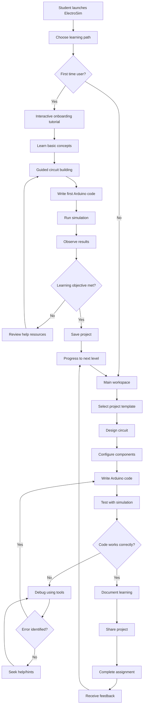
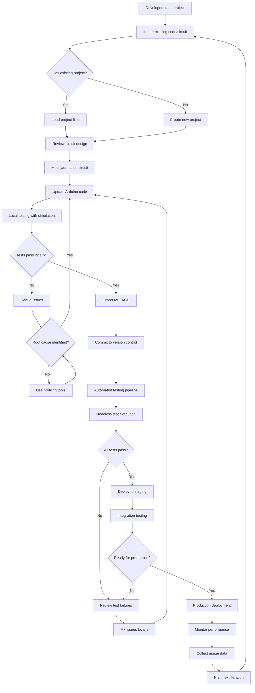
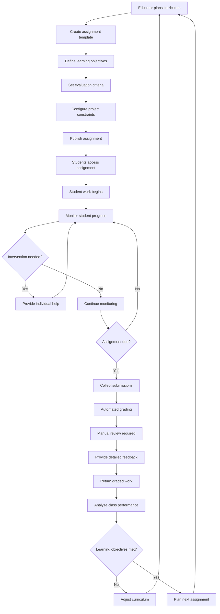
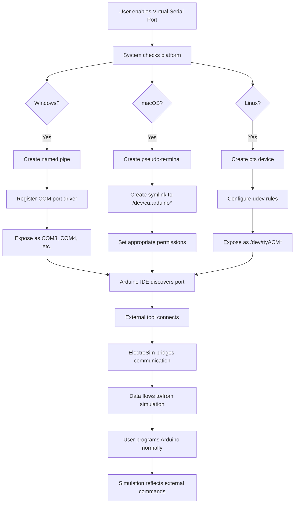
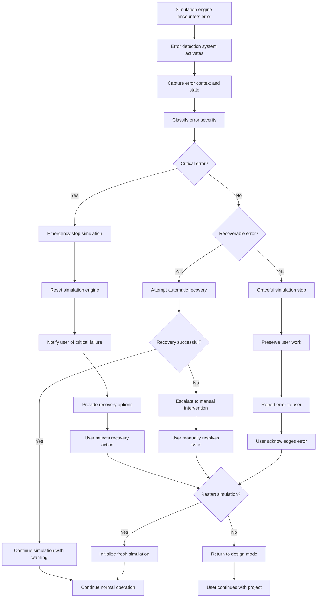

# ElectroSim Process Flow Diagrams and Use Cases
**Version:** 1.0  
**Date:** December 21, 2024  
**Business Analyst:** BA Team  
**Project:** ElectroSim Arduino Circuit Simulator  

---

## Overview

This document defines the key business processes, user workflows, and use cases for ElectroSim. Each process is documented with detailed flow diagrams, actor interactions, and success/failure scenarios to guide implementation and testing.

---

## Table of Contents

1. [Core Business Processes](#core-business-processes)
2. [Primary Use Cases](#primary-use-cases)
3. [Secondary Use Cases](#secondary-use-cases)
4. [System Integration Flows](#system-integration-flows)
5. [Error Handling and Exception Flows](#error-handling-and-exception-flows)

---

## Core Business Processes

### BP-001: Student Learning Process

#### Process Overview
This process represents the primary educational workflow where students learn Arduino programming through hands-on circuit design and simulation.

#### Process Flow Diagram



#### Process Actors
- **Primary Actor**: Student/Learner
- **Supporting Actors**: Educator, Help System, Simulation Engine

#### Key Process Steps
1. **Onboarding**: First-time users receive guided introduction
2. **Learning Path Selection**: Students choose appropriate difficulty level
3. **Circuit Design**: Visual drag-and-drop circuit construction
4. **Code Development**: Arduino programming with assistance
5. **Simulation Testing**: Real-time circuit behavior validation
6. **Debugging**: Error identification and resolution
7. **Documentation**: Learning reflection and project documentation
8. **Assessment**: Progress evaluation and feedback

#### Success Criteria
- Student completes circuit design within expected timeframe
- Code compiles successfully and achieves intended behavior
- Simulation results match expectations
- Learning objectives are met and documented

#### Business Rules
- All educational content must be age-appropriate and pedagogically sound
- Student progress must be trackable for instructor oversight
- Projects must be saveable for portfolio development
- Help resources must be immediately accessible

---

### BP-002: Professional Development Process

#### Process Overview
This process supports professional developers using ElectroSim for rapid prototyping, testing, and CI/CD integration.

#### Process Flow Diagram



#### Process Actors
- **Primary Actor**: Professional Developer
- **Supporting Actors**: CI/CD System, Version Control, Test Framework

#### Key Process Steps
1. **Project Setup**: Import/create professional Arduino project
2. **Design Iteration**: Circuit and code modification cycles
3. **Local Validation**: Comprehensive local testing and debugging
4. **CI/CD Integration**: Automated testing pipeline integration
5. **Quality Assurance**: Automated test suite execution
6. **Deployment**: Staging and production deployment workflows
7. **Monitoring**: Performance monitoring and optimization
8. **Iteration**: Continuous improvement based on data

#### Success Criteria
- Project integrates seamlessly with existing development workflow
- Automated testing provides reliable quality validation
- Performance meets production requirements
- Development cycle time is reduced compared to physical prototyping

#### Business Rules
- All code must pass automated quality gates
- Test coverage must meet organizational standards
- Performance benchmarks must be maintained
- Security scanning must be integrated into pipeline

---

### BP-003: Classroom Management Process

#### Process Overview
This process enables educators to manage assignments, track student progress, and provide feedback in classroom environments.

#### Process Flow Diagram



#### Process Actors
- **Primary Actor**: Educator/Instructor
- **Secondary Actors**: Students, Administration, Assessment System

#### Key Process Steps
1. **Curriculum Planning**: Learning objective definition and sequencing
2. **Assignment Creation**: Template and constraint development
3. **Student Engagement**: Assignment distribution and support
4. **Progress Monitoring**: Real-time student activity tracking
5. **Assessment**: Automated and manual evaluation processes
6. **Feedback Delivery**: Constructive feedback and guidance
7. **Performance Analysis**: Class-level learning analytics
8. **Curriculum Iteration**: Continuous improvement based on outcomes

#### Success Criteria
- Assignments align with educational standards and objectives
- Student engagement and completion rates meet targets
- Assessment provides fair and accurate evaluation
- Feedback supports student learning and improvement

#### Business Rules
- All student data must be protected per privacy regulations
- Assessment must be fair, consistent, and unbiased
- Feedback must be constructive and educationally valuable
- Progress tracking must support intervention when needed

---

## Primary Use Cases

### UC-001: Create and Test Basic Arduino Circuit

#### Use Case Overview
**Primary Actor**: Student  
**Goal**: Successfully create, program, and test a basic Arduino LED blink circuit  
**Scope**: ElectroSim Application  
**Level**: User Goal  

#### Preconditions
- ElectroSim application is installed and running
- User has basic understanding of electronics concepts
- Component library is loaded and accessible

#### Success Guarantee (Postconditions)
- Circuit is correctly designed and wired
- Arduino code compiles without errors
- Simulation demonstrates expected LED blinking behavior
- Project is saved for future reference

#### Main Success Scenario

1. **User launches application** and selects "New Project"
2. **System displays** main workspace with empty canvas
3. **User drags Arduino Uno** from component library to canvas
4. **User drags LED component** to canvas and positions near Arduino
5. **User drags 220Ω resistor** to canvas for current limiting
6. **User creates wire connection** from Arduino pin 13 to LED anode
7. **User creates wire connection** from LED cathode to resistor
8. **User creates wire connection** from resistor to Arduino GND
9. **System validates circuit** and shows no errors
10. **User switches to Code Editor tab**
11. **User writes Arduino blink code**:
    ```cpp
    void setup() {
      pinMode(13, OUTPUT);
    }
    void loop() {
      digitalWrite(13, HIGH);
      delay(1000);
      digitalWrite(13, LOW);
      delay(1000);
    }
    ```
12. **User clicks Compile button**
13. **System compiles code** successfully
14. **User clicks Upload button**
15. **System uploads code** to virtual Arduino
16. **User starts simulation**
17. **System begins simulation** - LED blinks every second
18. **User observes correct behavior**
19. **User saves project** with descriptive name
20. **System confirms** project saved successfully

#### Alternative Flows

**3a. User selects project template**
- 3a1. User chooses "LED Blink Template" from new project dialog
- 3a2. System loads pre-built circuit and code
- 3a3. User proceeds to step 16 (simulation)

**9a. Circuit validation fails**
- 9a1. System highlights wiring errors in red
- 9a2. System displays error message with specific issues
- 9a3. User corrects wiring errors
- 9a4. Return to step 9

**12a. Code compilation fails**
- 12a1. System displays compilation errors with line numbers
- 12a2. User corrects syntax errors
- 12a3. Return to step 12

**17a. Simulation shows unexpected behavior**
- 17a1. User stops simulation
- 17a2. User reviews circuit connections and code logic
- 17a3. User makes corrections as needed
- 17a4. Return to step 14 (upload corrected code)

#### Exception Flows

**E1. Component library fails to load**
- E1.1. System displays error message
- E1.2. System attempts to reload component library
- E1.3. If reload fails, system suggests application restart

**E2. Arduino code compilation system unavailable**
- E2.1. System displays compilation service error
- E2.2. System saves code for later compilation
- E2.3. User can continue with circuit design

**E3. Simulation engine fails to start**
- E3.1. System displays simulation error
- E3.2. System resets virtual Arduino
- E3.3. User can retry simulation or restart application

#### Special Requirements
- Circuit validation must occur in real-time during wiring
- Code editor must provide Arduino-specific syntax highlighting
- Simulation must maintain 60 FPS for smooth LED animation
- Component drag-and-drop must work reliably on all platforms

#### Technology and Data Variations
- Windows, macOS, and Linux platform support
- Component library data loaded from local storage
- Project data stored in JSON format
- Arduino code compiled using integrated avr8js emulator

#### Frequency of Occurrence
- Expected: 100+ times per day across all users
- Peak usage during educational hours (9 AM - 5 PM)

---

### UC-002: Debug Arduino Code with Simulation

#### Use Case Overview
**Primary Actor**: Student or Professional Developer  
**Goal**: Identify and fix issues in Arduino code using simulation debugging tools  
**Scope**: ElectroSim Application  
**Level**: User Goal  

#### Preconditions
- User has an existing Arduino project with uploaded code
- Simulation engine is functional
- Debugging tools are enabled
- Code contains logical or runtime errors

#### Success Guarantee (Postconditions)
- Issue is identified and understood by user
- Code is corrected to eliminate the problem
- Simulation demonstrates correct behavior
- User understanding of debugging process is improved

#### Main Success Scenario

1. **User opens existing project** with problematic Arduino code
2. **User starts simulation** expecting certain behavior
3. **System runs simulation** but behavior is incorrect or unexpected
4. **User stops simulation** to begin debugging process
5. **User switches to Code Editor** and reviews code
6. **User sets breakpoint** by clicking line number margin at line 10
7. **User starts simulation in debug mode**
8. **System executes code** until breakpoint is reached
9. **System pauses execution** and highlights current line
10. **User examines variable values** in debug panel
11. **User notices** variable `count` has unexpected value
12. **User steps through next few lines** using Step Over button
13. **User observes** how variable values change
14. **User identifies** logic error in loop condition
15. **User stops debugging** and modifies code
16. **User corrects the logic error**:
    ```cpp
    // Changed from: for(int i = 0; i <= count; i++)
    // To: for(int i = 0; i < count; i++)
    ```
17. **User removes breakpoint** by clicking it again
18. **User compiles and uploads** corrected code
19. **User runs simulation** without debug mode
20. **System demonstrates** correct behavior
21. **User saves corrected project**

#### Alternative Flows

**6a. User uses Serial Monitor for debugging**
- 6a1. User adds Serial.print() statements to code
- 6a2. User compiles and uploads code
- 6a3. User monitors serial output during simulation
- 6a4. User identifies issue from serial output patterns
- 6a5. Continue to step 15

**10a. User needs to inspect array or complex data**
- 10a1. User expands array variable in debug panel
- 10a2. User examines individual array elements
- 10a3. User identifies out-of-bounds access or incorrect values
- 10a4. Continue to step 14

**13a. User needs to step into function calls**
- 13a1. User uses Step Into button instead of Step Over
- 13a2. Execution moves to first line of called function
- 13a3. User continues debugging within function
- 13a4. Continue to step 14

#### Exception Flows

**E1. Debugging system fails to attach**
- E1.1. System displays debugging unavailable message
- E1.2. User falls back to Serial Monitor debugging
- E1.3. User adds debug print statements to code

**E2. Simulation crashes during debugging**
- E2.1. System captures crash information
- E2.2. System resets simulation engine
- E2.3. User can attempt debugging again or report issue

**E3. Breakpoint fails to trigger**
- E3.1. System checks if line contains executable code
- E3.2. If line is comment/declaration, system suggests valid line
- E3.3. User moves breakpoint to executable line

#### Special Requirements
- Debugging must not significantly impact simulation performance
- Variable inspection must show accurate real-time values
- Breakpoint management must be intuitive and reliable
- Step execution must provide precise control over program flow

#### Technology and Data Variations
- Debug information generated during code compilation
- Variable state tracked by AVR emulator
- Breakpoint data stored in project configuration
- Debug UI updates synchronized with simulation engine

---

### UC-003: Run Automated Tests in CI/CD Pipeline

#### Use Case Overview
**Primary Actor**: CI/CD System (automated)  
**Secondary Actor**: Professional Developer (setup)  
**Goal**: Execute automated Arduino tests in headless mode for continuous integration  
**Scope**: ElectroSim CLI and Testing Framework  
**Level**: System Goal  

#### Preconditions
- ElectroSim CLI is installed on build server
- Test specifications are defined and checked into version control
- Arduino project code is available
- Circuit definition files are present

#### Success Guarantee (Postconditions)
- All defined tests execute without system errors
- Test results are reported in standard format (JUnit XML)
- Pass/fail status is accurately determined
- Test artifacts are preserved for analysis

#### Main Success Scenario

1. **Developer commits code** to version control repository
2. **CI system detects commit** and triggers build pipeline
3. **CI system checks out** project code and test definitions
4. **CI system installs** ElectroSim CLI as build dependency
5. **CI system executes** test command: `electrosim test --config tests.yml`
6. **ElectroSim CLI loads** test configuration file
7. **System validates** test specification format and completeness
8. **System initializes** headless simulation environment
9. **For each test case**:
   - System loads specified circuit file
   - System compiles Arduino code for target board
   - System uploads code to virtual Arduino
   - System starts simulation with specified parameters
   - System executes assertions against simulation behavior
   - System records test results and timing
10. **System generates** comprehensive test report
11. **System outputs** JUnit XML format results
12. **System exits** with appropriate status code (0=success, 1=failure)
13. **CI system processes** test results
14. **CI system publishes** test report to dashboard
15. **CI system notifies** development team of results

#### Alternative Flows

**6a. Configuration file contains errors**
- 6a1. System validates configuration and identifies errors
- 6a2. System outputs detailed error messages
- 6a3. System exits with error status code
- 6a4. CI system reports configuration failure

**9a. Circuit file is missing or invalid**
- 9a1. System attempts to load circuit file
- 9a2. System reports file not found or format error
- 9a3. System skips test and marks as failed
- 9a4. System continues with remaining tests

**9b. Arduino code compilation fails**
- 9b1. System attempts compilation
- 9b2. System captures compilation errors
- 9b3. System marks test as failed with compilation details
- 9b4. System continues with remaining tests

**9c. Assertion fails during test execution**
- 9c1. System executes assertion check
- 9c2. System records assertion failure with details
- 9c3. System marks test as failed
- 9c4. System continues with remaining assertions

#### Exception Flows

**E1. ElectroSim CLI installation fails**
- E1.1. CI system reports installation error
- E1.2. Build pipeline fails immediately
- E1.3. Developer receives notification of infrastructure issue

**E2. Simulation engine fails to initialize**
- E2.1. System attempts engine initialization
- E2.2. System reports engine failure with diagnostics
- E2.3. All tests marked as error state
- E2.4. System exits with infrastructure error code

**E3. Test execution timeout exceeded**
- E3.1. System monitors test execution time
- E3.2. System terminates long-running test
- E3.3. System marks test as timeout failure
- E3.4. System continues with remaining tests

#### Test Configuration Example

```yaml
# tests.yml
test_suite:
  name: "Arduino LED Controller Tests"
  timeout: 300  # 5 minutes maximum

tests:
  - name: "LED Blink Test"
    circuit: "circuits/led_blink.json"
    sketch: "sketches/led_blink.ino"
    board: "uno"
    timeout: 30
    assertions:
      - type: "pin-state"
        pin: 13
        expected: "HIGH"
        timeout: 2000
        description: "LED should turn on within 2 seconds"
      - type: "pin-state"
        pin: 13
        expected: "LOW"
        timeout: 3000
        description: "LED should turn off after 1 second"
      - type: "serial-output"
        expected: "LED Blink Started"
        timeout: 1000
        description: "Serial output should confirm startup"

  - name: "Button Input Test"
    circuit: "circuits/button_input.json"
    sketch: "sketches/button_input.ino"
    board: "uno"
    setup: "press_button(2)"  # Simulate button press
    assertions:
      - type: "serial-output"
        expected: "Button pressed"
        timeout: 1000
```

#### Special Requirements
- CLI must operate without GUI dependencies
- Test execution must be deterministic and repeatable
- Resource usage must be appropriate for CI environment
- Test reporting must integrate with standard CI tools

#### Technology and Data Variations
- Supports multiple CI platforms (GitHub Actions, Jenkins, GitLab CI)
- Compatible with Docker containers for isolated execution
- Test artifacts stored in standard formats
- Parallel test execution for performance optimization

---

## Secondary Use Cases

### UC-004: Create Educational Assignment Template

#### Use Case Overview
**Primary Actor**: Educator  
**Goal**: Create reusable assignment template for student use  
**Scope**: ElectroSim Educational Features  
**Level**: User Goal  

#### Preconditions
- Educator has ElectroSim installed with educational features enabled
- Educator has planned learning objectives and assignment requirements
- Component library and templates are available

#### Success Guarantee (Postconditions)
- Assignment template is created with all required elements
- Template includes instructional content and constraints
- Template is validated and ready for student distribution
- Assignment metadata is properly configured

#### Main Success Scenario

1. **Educator selects** "Create Assignment Template" from Tools menu
2. **System displays** assignment creation wizard
3. **Educator enters** assignment metadata:
   - Title: "Traffic Light Controller"
   - Subject: "Digital Logic and Arduino Programming"
   - Difficulty Level: "Intermediate"
   - Estimated Time: "90 minutes"
   - Learning Objectives: "Understand digital outputs, timing, state machines"
4. **Educator defines** project constraints:
   - Required components: Arduino Uno, 3 LEDs (red, yellow, green), resistors
   - Forbidden components: Advanced sensors, communication modules
   - Code requirements: Use only digitalWrite() and delay() functions
5. **Educator creates** starter circuit template:
   - Places Arduino Uno on canvas
   - Adds three LEDs in traffic light configuration
   - Adds current limiting resistors
   - Leaves connections for students to complete
6. **Educator writes** starter code template:
   ```cpp
   // Traffic Light Controller
   // Complete the code to create a realistic traffic light sequence
   
   void setup() {
     // TODO: Configure pins as outputs
   }
   
   void loop() {
     // TODO: Implement traffic light sequence
     // Red: 5 seconds
     // Green: 8 seconds  
     // Yellow: 2 seconds
   }
   ```
7. **Educator creates** instructional content:
   - Step-by-step wiring instructions
   - Code completion guidance
   - Expected behavior description
   - Common troubleshooting tips
8. **Educator defines** grading rubric:
   - Circuit wiring correctness (30 points)
   - Code functionality (40 points)
   - Code style and comments (20 points)
   - Creativity and enhancement (10 points)
9. **Educator sets** submission requirements:
   - Both circuit and code must be completed
   - Include written reflection on learning
   - Due date: 1 week from assignment date
10. **System validates** assignment template completeness
11. **System generates** assignment package with all components
12. **Educator reviews** generated assignment in student view
13. **Educator publishes** assignment to class repository
14. **System confirms** assignment is available for distribution

#### Alternative Flows

**5a. Educator imports existing circuit**
- 5a1. Educator selects "Import Circuit" option
- 5a2. System displays file browser
- 5a3. Educator selects existing .json circuit file
- 5a4. System loads circuit and allows modifications
- 5a5. Continue to step 6

**10a. Assignment validation fails**
- 10a1. System identifies missing or invalid elements
- 10a2. System displays specific validation errors
- 10a3. Educator corrects identified issues
- 10a4. Return to step 10

**12a. Assignment preview reveals issues**
- 12a1. Educator identifies problems in student view
- 12a2. Educator returns to editing mode
- 12a3. Educator makes necessary corrections
- 12a4. Return to step 12

#### Exception Flows

**E1. Circuit template creation fails**
- E1.1. System reports circuit generation error
- E1.2. Educator can retry or create circuit manually
- E1.3. System preserves other assignment components

**E2. Grading rubric validation fails**
- E2.1. System identifies rubric inconsistencies
- E2.2. System suggests corrections
- E2.3. Educator must fix rubric before proceeding

#### Special Requirements
- Assignment must be exportable for different class management systems
- Template should support multiple difficulty variants
- Grading rubric must be compatible with institutional standards
- Assignment content must be accessible and inclusive

---

## System Integration Flows

### INT-001: Virtual Serial Port Integration Flow

#### Integration Overview
This flow describes how ElectroSim integrates with the operating system to create virtual serial ports that external Arduino tools can connect to.

#### Integration Flow Diagram



#### Platform-Specific Implementation

**Windows Implementation:**
- Create named pipe with appropriate security settings
- Register virtual COM port driver
- Handle Windows device manager integration
- Support multiple concurrent ports

**macOS Implementation:**  
- Create BSD pseudo-terminal pair
- Symlink to standard Arduino device names
- Handle macOS security permissions
- Support USB device emulation

**Linux Implementation:**
- Create pseudo-terminal slave (pts)
- Configure udev rules for device naming
- Set appropriate user permissions
- Support multiple Arduino devices

#### Integration Success Criteria
- External Arduino IDE can discover and connect to virtual port
- Sketch upload from external tools works correctly
- Serial communication flows bidirectionally
- Virtual port behaves identically to physical Arduino

---

## Error Handling and Exception Flows

### ERR-001: Simulation Engine Failure Recovery

#### Error Scenario Flow



#### Error Recovery Strategies

**Critical Errors** (Simulation engine crash):
- Immediate simulation stop
- Memory cleanup and resource release
- User notification with recovery options
- Option to restart or return to design mode

**Recoverable Errors** (Component malfunction):
- Automatic retry with backoff
- Component reset or replacement
- Continue simulation with logging
- User notification of recovered issue

**User-Induced Errors** (Invalid configuration):
- Prevent invalid operations at UI level
- Provide clear feedback and correction guidance
- Maintain simulation integrity
- Educational explanations of errors

---

## Business Value and Success Metrics

### Process Effectiveness Metrics

**Student Learning Process (BP-001)**
- **Success Rate**: 85% of students complete basic circuits successfully
- **Learning Time**: Average 30 minutes from start to working circuit
- **Retention**: 70% of students return for additional projects
- **Understanding**: 90% demonstrate comprehension in assessments

**Professional Development Process (BP-002)**
- **Productivity**: 50% reduction in prototype-to-test cycle time
- **Quality**: 95% of automated tests pass in CI/CD pipeline
- **Adoption**: 100+ professional developers using regularly
- **Integration**: Support for 5+ popular CI/CD platforms

**Classroom Management Process (BP-003)**
- **Efficiency**: 75% reduction in manual grading time
- **Engagement**: 90% student participation in assignments
- **Outcomes**: 80% of classes meet learning objectives
- **Satisfaction**: 4.5/5 instructor satisfaction rating

### Use Case Performance Targets

**Create and Test Basic Arduino Circuit (UC-001)**
- **Completion Time**: 95% completed within 45 minutes
- **Success Rate**: 90% achieve working simulation on first attempt
- **Error Rate**: <5% encounter blocking technical issues
- **User Satisfaction**: 4.0/5 average rating

**Debug Arduino Code with Simulation (UC-002)**
- **Problem Resolution**: 80% of issues identified within 15 minutes
- **Tool Effectiveness**: 70% prefer simulation debugging over hardware
- **Learning Impact**: 85% report improved debugging skills
- **Feature Usage**: 60% of active users utilize debugging features

**Run Automated Tests in CI/CD Pipeline (UC-003)**
- **Reliability**: 99% uptime for CI/CD integration
- **Performance**: <5 minutes execution time for standard test suite
- **Compatibility**: Support for 90% of common CI platforms
- **Adoption**: 25% of professional users implement CI/CD testing

---

## Conclusion

The process flows and use cases documented here provide a comprehensive blueprint for ElectroSim implementation and testing. Each process includes detailed success criteria, alternative flows, and exception handling to ensure robust and user-friendly operation.

These flows directly support the business requirements identified in the BRD and provide clear guidance for:
- Development team implementation priorities
- Quality assurance testing scenarios  
- User experience design decisions
- Success measurement and optimization

The integration flows ensure ElectroSim works seamlessly with existing development tools and educational environments, while the error handling flows provide robust recovery mechanisms for production use.

**Next Steps:**
1. Technical team review and implementation planning
2. User experience design based on documented flows
3. Test case development from use case scenarios
4. Performance benchmark definition from success criteria
5. Integration testing strategy for external tool compatibility

---

**Document Control:**
- **Version**: 1.0
- **Last Updated**: December 21, 2024
- **Next Review**: January 21, 2025
- **Process Count**: 3 core business processes, 4 primary use cases, 1 secondary use case