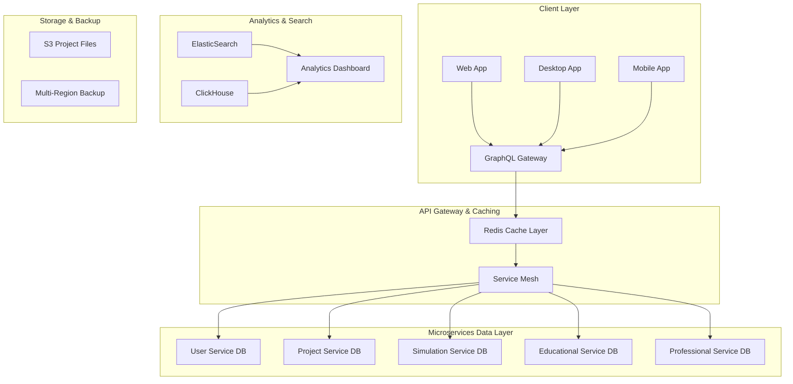

# ElectroSim Database Architecture Strategy
**Version:** 1.0  
**Date:** December 21, 2024  
**Database Architect:** DA Team  
**Project:** ElectroSim Arduino Circuit Simulator - Database Evolution Strategy

---

## 📋 Executive Summary

### Current State Assessment
ElectroSim currently operates as a desktop Electron application with file-based project storage (.esp files) and Redux state management. While this architecture supports excellent single-user functionality with 99% test coverage, it fundamentally cannot scale to support the target 300,000+ monthly active users requiring real-time collaboration and multi-tenancy.

### Strategic Transformation Required
**From**: Desktop file-based storage → **To**: Distributed web-scale database architecture
**Support**: Single users → **Support**: 300K concurrent users with real-time collaboration
**Compliance**: None → **Compliance**: GDPR, FERPA, SOC2 educational data protection

### Business Impact
- **Market Expansion**: Enable $80M TAM capture through web accessibility
- **Educational Integration**: Support 100+ institutions with multi-tenancy
- **Professional Workflows**: CI/CD integration with workflow data management
- **Revenue Growth**: Enable $0 → $5M ARR progression through platform scaling

---

## 🎯 Database Architecture Vision

### Core Principles
1. **Scalability First**: Design for 300K+ concurrent users from day one
2. **Educational Compliance**: GDPR, FERPA, SOC2 data protection by design
3. **Real-time Collaboration**: Event-driven architecture supporting simultaneous editing
4. **Zero Downtime Migration**: Preserve all existing .esp project data during transition
5. **Performance Excellence**: Sub-100ms global query performance with 99.9% uptime

### Architecture Philosophy
```typescript
interface DatabaseArchitecturePhilosophy {
  scalability: {
    pattern: 'Microservices with dedicated data stores';
    distribution: 'Multi-region with intelligent routing';
    caching: 'Multi-layer with Redis and CDN integration';
  };
  
  consistency: {
    pattern: 'CQRS with Event Sourcing';
    collaboration: 'Operational Transform conflict resolution';
    transactions: 'ACID compliance with distributed transactions';
  };
  
  security: {
    architecture: 'Zero Trust with encryption at rest and in transit';
    compliance: 'GDPR, FERPA, SOC2 multi-tenancy isolation';
    access: 'Fine-grained RBAC with institutional policies';
  };
  
  performance: {
    target: '<100ms p95 latency globally';
    throughput: '300K concurrent users';
    availability: '99.9% uptime SLA';
  };
}
```

---

## 🏗️ Current State Analysis

### File-Based Architecture Assessment
**Strengths**:
- ✅ Excellent data models with comprehensive TypeScript interfaces
- ✅ Version migration system already implemented
- ✅ Strong serialization/deserialization with validation
- ✅ Auto-save and recovery mechanisms
- ✅ Project template system

**Critical Limitations**:
- ❌ No multi-user support or collaboration capabilities
- ❌ No web accessibility - desktop-only application
- ❌ No real-time synchronization or conflict resolution
- ❌ No multi-tenancy for educational institutions
- ❌ No analytics or progress tracking capabilities
- ❌ No API access for CI/CD integration

### Data Model Excellence Foundation
The existing Project.ts data models provide an exceptional foundation for database schema design:

```typescript
// Current ElectroSimProject structure - Ready for normalization
interface ElectroSimProject {
  metadata: ProjectMetadata;     // → projects table
  circuit: CircuitData;          // → circuits, components, wires tables
  code: CodeData;               // → code_versions, libraries tables  
  settings: ProjectSettings;     // → project_settings table
  version: string;              // → schema_versions table
}
```

**Migration Advantages**:
- Strong typing enables seamless ORM integration
- Validation schemas translate directly to database constraints
- Version migration system maps to database schema evolution
- Comprehensive interfaces support GraphQL schema generation

---

## 🎯 Target Database Architecture

### Service-Oriented Data Architecture



### Database Technology Stack

#### Primary Databases
```yaml
User Service Database:
  technology: PostgreSQL 15+
  purpose: Authentication, authorization, user profiles, institutional tenancy
  scaling: Read replicas, connection pooling
  compliance: GDPR consent management, audit logging
  
Project Service Database:
  technology: PostgreSQL 15+
  purpose: Project metadata, sharing, collaboration state
  scaling: Partitioning by organization, read replicas
  features: JSONB for flexible circuit data, full-text search
  
Simulation Service Database:
  technology: PostgreSQL 15+ with TimescaleDB extension
  purpose: Simulation runs, performance metrics, debugging data
  scaling: Time-series optimization, automatic retention
  performance: Optimized for high-frequency writes
  
Educational Service Database:
  technology: PostgreSQL 15+
  purpose: Tutorials, assessments, progress tracking, LTI integration
  scaling: Read-heavy optimization, CDN integration
  analytics: Integration with business intelligence tools
```

#### Specialized Data Stores
```yaml
Real-time Collaboration:
  technology: Redis Cluster
  purpose: Operational Transform state, WebSocket sessions
  scaling: Sharding by project, memory optimization
  persistence: AOF with background save
  
Search & Analytics:
  technology: ElasticSearch 8+
  purpose: Project search, code analysis, educational content
  scaling: Multi-node cluster with dedicated ingest nodes
  features: Semantic search, syntax highlighting
  
Time-Series Analytics:
  technology: ClickHouse
  purpose: Performance metrics, usage analytics, billing data
  scaling: Distributed table engine, materialized views
  features: Real-time dashboards, educational insights
  
File Storage:
  technology: Multi-cloud S3-compatible
  purpose: Project files, assets, backups, export artifacts
  scaling: CDN integration, geographic distribution
  security: Encryption at rest, signed URLs
```

---

## 📊 Logical Data Model Design

### Core Domain Models

#### User Management & Multi-Tenancy
```sql
-- Organizations (Educational Institutions & Enterprises)
CREATE TABLE organizations (
    id UUID PRIMARY KEY DEFAULT gen_random_uuid(),
    name VARCHAR(255) NOT NULL,
    type ORGANIZATION_TYPE NOT NULL, -- 'educational', 'enterprise', 'personal'
    domain VARCHAR(255),
    settings JSONB,
    subscription_plan VARCHAR(50),
    max_users INTEGER,
    max_projects INTEGER,
    created_at TIMESTAMP WITH TIME ZONE DEFAULT NOW(),
    updated_at TIMESTAMP WITH TIME ZONE DEFAULT NOW(),
    
    CONSTRAINT unique_domain UNIQUE (domain)
);

-- Users with comprehensive educational profiles
CREATE TABLE users (
    id UUID PRIMARY KEY DEFAULT gen_random_uuid(),
    organization_id UUID REFERENCES organizations(id) ON DELETE SET NULL,
    email VARCHAR(255) NOT NULL UNIQUE,
    username VARCHAR(100) NOT NULL,
    display_name VARCHAR(255),
    role USER_ROLE NOT NULL DEFAULT 'student',
    educational_profile JSONB, -- Learning progress, preferences, achievements
    preferences JSONB,
    last_login TIMESTAMP WITH TIME ZONE,
    email_verified BOOLEAN DEFAULT FALSE,
    created_at TIMESTAMP WITH TIME ZONE DEFAULT NOW(),
    updated_at TIMESTAMP WITH TIME ZONE DEFAULT NOW(),
    
    CONSTRAINT unique_username_per_org UNIQUE (organization_id, username)
);

-- Granular permission system for educational compliance
CREATE TABLE user_permissions (
    id UUID PRIMARY KEY DEFAULT gen_random_uuid(),
    user_id UUID NOT NULL REFERENCES users(id) ON DELETE CASCADE,
    organization_id UUID NOT NULL REFERENCES organizations(id) ON DELETE CASCADE,
    resource_type VARCHAR(50) NOT NULL, -- 'project', 'tutorial', 'assessment'
    resource_id UUID,
    permission_level PERMISSION_LEVEL NOT NULL, -- 'read', 'write', 'admin', 'owner'
    granted_by UUID REFERENCES users(id),
    expires_at TIMESTAMP WITH TIME ZONE,
    created_at TIMESTAMP WITH TIME ZONE DEFAULT NOW(),
    
    CONSTRAINT unique_permission UNIQUE (user_id, resource_type, resource_id)
);
```

#### Project Management & Collaboration
```sql
-- Projects with comprehensive metadata and collaboration
CREATE TABLE projects (
    id UUID PRIMARY KEY DEFAULT gen_random_uuid(),
    organization_id UUID REFERENCES organizations(id) ON DELETE CASCADE,
    owner_id UUID NOT NULL REFERENCES users(id) ON DELETE CASCADE,
    name VARCHAR(255) NOT NULL,
    description TEXT,
    version VARCHAR(20) NOT NULL DEFAULT '2.0.0',
    visibility PROJECT_VISIBILITY NOT NULL DEFAULT 'private',
    sharing_settings JSONB,
    educational_metadata JSONB, -- Difficulty, learning objectives, prerequisites
    professional_metadata JSONB, -- CI/CD integration, workflow data
    tags TEXT[] DEFAULT ARRAY[]::TEXT[],
    thumbnail_url VARCHAR(500),
    
    -- Collaboration state
    collaboration_enabled BOOLEAN DEFAULT FALSE,
    current_editors UUID[] DEFAULT ARRAY[]::UUID[],
    lock_timestamp TIMESTAMP WITH TIME ZONE,
    lock_owner_id UUID REFERENCES users(id),
    
    -- Timing and versioning
    created_at TIMESTAMP WITH TIME ZONE DEFAULT NOW(),
    updated_at TIMESTAMP WITH TIME ZONE DEFAULT NOW(),
    last_accessed TIMESTAMP WITH TIME ZONE DEFAULT NOW(),
    
    CONSTRAINT unique_project_name_per_org UNIQUE (organization_id, name)
);

-- Circuit data with normalized component storage
CREATE TABLE circuits (
    id UUID PRIMARY KEY DEFAULT gen_random_uuid(),
    project_id UUID NOT NULL REFERENCES projects(id) ON DELETE CASCADE,
    board_type VARCHAR(50) NOT NULL,
    canvas_settings JSONB NOT NULL,
    created_at TIMESTAMP WITH TIME ZONE DEFAULT NOW(),
    updated_at TIMESTAMP WITH TIME ZONE DEFAULT NOW()
);

-- Components with flexible properties and educational annotations
CREATE TABLE circuit_components (
    id UUID PRIMARY KEY DEFAULT gen_random_uuid(),
    circuit_id UUID NOT NULL REFERENCES circuits(id) ON DELETE CASCADE,
    component_id VARCHAR(100) NOT NULL, -- User-defined component identifier
    type VARCHAR(100) NOT NULL,
    name VARCHAR(255) NOT NULL,
    position JSONB NOT NULL, -- {x, y, rotation}
    properties JSONB NOT NULL,
    connections JSONB NOT NULL,
    educational_metadata JSONB, -- Tooltips, explanations, learning notes
    created_at TIMESTAMP WITH TIME ZONE DEFAULT NOW(),
    
    CONSTRAINT unique_component_per_circuit UNIQUE (circuit_id, component_id)
);

-- Wires with comprehensive connection data
CREATE TABLE circuit_wires (
    id UUID PRIMARY KEY DEFAULT gen_random_uuid(),
    circuit_id UUID NOT NULL REFERENCES circuits(id) ON DELETE CASCADE,
    wire_id VARCHAR(100) NOT NULL,
    from_connection JSONB NOT NULL,
    to_connection JSONB NOT NULL,
    properties JSONB,
    created_at TIMESTAMP WITH TIME ZONE DEFAULT NOW(),
    
    CONSTRAINT unique_wire_per_circuit UNIQUE (circuit_id, wire_id)
);
```

#### Code Management & Version Control
```sql
-- Code versions with comprehensive Arduino metadata
CREATE TABLE code_versions (
    id UUID PRIMARY KEY DEFAULT gen_random_uuid(),
    project_id UUID NOT NULL REFERENCES projects(id) ON DELETE CASCADE,
    version INTEGER NOT NULL,
    main_sketch TEXT NOT NULL,
    includes TEXT[] DEFAULT ARRAY[]::TEXT[],
    compilation_settings JSONB,
    created_by UUID NOT NULL REFERENCES users(id),
    commit_message TEXT,
    created_at TIMESTAMP WITH TIME ZONE DEFAULT NOW(),
    
    CONSTRAINT unique_version_per_project UNIQUE (project_id, version)
);

-- Library management with version tracking
CREATE TABLE project_libraries (
    id UUID PRIMARY KEY DEFAULT gen_random_uuid(),
    project_id UUID NOT NULL REFERENCES projects(id) ON DELETE CASCADE,
    name VARCHAR(255) NOT NULL,
    version VARCHAR(50),
    source LIBRARY_SOURCE NOT NULL, -- 'builtin', 'community', 'local'
    path VARCHAR(500),
    dependencies JSONB,
    added_at TIMESTAMP WITH TIME ZONE DEFAULT NOW(),
    
    CONSTRAINT unique_library_per_project UNIQUE (project_id, name)
);
```

#### Educational System Integration
```sql
-- Tutorials and educational content
CREATE TABLE tutorials (
    id UUID PRIMARY KEY DEFAULT gen_random_uuid(),
    organization_id UUID REFERENCES organizations(id),
    title VARCHAR(255) NOT NULL,
    description TEXT,
    difficulty DIFFICULTY_LEVEL NOT NULL,
    estimated_duration INTEGER, -- minutes
    learning_objectives TEXT[],
    prerequisites TEXT[],
    category VARCHAR(100),
    tags TEXT[] DEFAULT ARRAY[]::TEXT[],
    content JSONB NOT NULL, -- Steps, resources, assessments
    template_project_id UUID REFERENCES projects(id),
    is_published BOOLEAN DEFAULT FALSE,
    created_by UUID NOT NULL REFERENCES users(id),
    created_at TIMESTAMP WITH TIME ZONE DEFAULT NOW(),
    updated_at TIMESTAMP WITH TIME ZONE DEFAULT NOW()
);

-- Student progress tracking with detailed analytics
CREATE TABLE student_progress (
    id UUID PRIMARY KEY DEFAULT gen_random_uuid(),
    student_id UUID NOT NULL REFERENCES users(id) ON DELETE CASCADE,
    tutorial_id UUID NOT NULL REFERENCES tutorials(id) ON DELETE CASCADE,
    organization_id UUID NOT NULL REFERENCES organizations(id) ON DELETE CASCADE,
    
    -- Progress tracking
    status PROGRESS_STATUS NOT NULL DEFAULT 'not_started',
    current_step INTEGER DEFAULT 0,
    completion_percentage DECIMAL(5,2) DEFAULT 0.00,
    time_spent INTEGER DEFAULT 0, -- minutes
    attempts INTEGER DEFAULT 0,
    
    -- Learning analytics
    interaction_data JSONB, -- Click patterns, time on steps, help requests
    assessment_scores JSONB,
    code_quality_metrics JSONB,
    
    -- Compliance and privacy
    consent_given BOOLEAN DEFAULT FALSE,
    data_retention_until TIMESTAMP WITH TIME ZONE,
    
    started_at TIMESTAMP WITH TIME ZONE,
    completed_at TIMESTAMP WITH TIME ZONE,
    last_accessed TIMESTAMP WITH TIME ZONE DEFAULT NOW(),
    
    CONSTRAINT unique_student_tutorial UNIQUE (student_id, tutorial_id)
);
```

#### Professional Workflow Integration
```sql
-- CI/CD integration and professional workflows
CREATE TABLE ci_cd_integrations (
    id UUID PRIMARY KEY DEFAULT gen_random_uuid(),
    project_id UUID NOT NULL REFERENCES projects(id) ON DELETE CASCADE,
    organization_id UUID NOT NULL REFERENCES organizations(id) ON DELETE CASCADE,
    integration_type VARCHAR(50) NOT NULL, -- 'github', 'gitlab', 'jenkins', etc.
    configuration JSONB NOT NULL,
    webhook_url VARCHAR(500),
    api_key_hash VARCHAR(255),
    is_active BOOLEAN DEFAULT TRUE,
    last_sync TIMESTAMP WITH TIME ZONE,
    created_at TIMESTAMP WITH TIME ZONE DEFAULT NOW(),
    
    CONSTRAINT unique_integration_per_project UNIQUE (project_id, integration_type)
);

-- Test execution and results for professional workflows  
CREATE TABLE test_executions (
    id UUID PRIMARY KEY DEFAULT gen_random_uuid(),
    project_id UUID NOT NULL REFERENCES projects(id) ON DELETE CASCADE,
    integration_id UUID REFERENCES ci_cd_integrations(id),
    test_suite_name VARCHAR(255),
    trigger_type VARCHAR(50), -- 'manual', 'webhook', 'scheduled'
    triggered_by UUID REFERENCES users(id),
    
    -- Execution details
    status EXECUTION_STATUS NOT NULL, -- 'pending', 'running', 'completed', 'failed'
    start_time TIMESTAMP WITH TIME ZONE DEFAULT NOW(),
    end_time TIMESTAMP WITH TIME ZONE,
    duration_ms INTEGER,
    
    -- Results and metrics
    test_results JSONB,
    performance_metrics JSONB,
    simulation_data JSONB,
    artifact_urls JSONB,
    
    created_at TIMESTAMP WITH TIME ZONE DEFAULT NOW()
);
```

---

## 🚀 Real-Time Collaboration Architecture

### Event Sourcing & CQRS Implementation

```sql
-- Event store for real-time collaboration
CREATE TABLE project_events (
    id UUID PRIMARY KEY DEFAULT gen_random_uuid(),
    project_id UUID NOT NULL REFERENCES projects(id) ON DELETE CASCADE,
    user_id UUID NOT NULL REFERENCES users(id),
    event_type VARCHAR(100) NOT NULL,
    event_data JSONB NOT NULL,
    operation_transform_data JSONB, -- For conflict resolution
    sequence_number BIGSERIAL,
    timestamp TIMESTAMP WITH TIME ZONE DEFAULT NOW(),
    
    -- Indexing for performance
    INDEX idx_project_events_project_sequence (project_id, sequence_number),
    INDEX idx_project_events_timestamp (timestamp DESC)
);

-- Collaboration sessions for real-time editing
CREATE TABLE collaboration_sessions (
    id UUID PRIMARY KEY DEFAULT gen_random_uuid(),
    project_id UUID NOT NULL REFERENCES projects(id) ON DELETE CASCADE,
    user_id UUID NOT NULL REFERENCES users(id) ON DELETE CASCADE,
    socket_id VARCHAR(255) NOT NULL,
    cursor_position JSONB,
    selection_range JSONB,
    is_active BOOLEAN DEFAULT TRUE,
    last_heartbeat TIMESTAMP WITH TIME ZONE DEFAULT NOW(),
    joined_at TIMESTAMP WITH TIME ZONE DEFAULT NOW(),
    
    CONSTRAINT unique_user_project_session UNIQUE (project_id, user_id, socket_id)
);
```

### Conflict Resolution Strategy
```typescript
interface OperationalTransform {
  // Operational Transform implementation for real-time collaboration
  transformOperation(operation: EditOperation, concurrent: EditOperation[]): EditOperation;
  
  // Circuit editing operations
  operations: {
    'component.add': ComponentAddOperation;
    'component.move': ComponentMoveOperation;
    'component.delete': ComponentDeleteOperation;
    'wire.connect': WireConnectOperation;
    'code.edit': CodeEditOperation;
    'settings.update': SettingsUpdateOperation;
  };
  
  // Conflict resolution priorities
  conflictResolution: {
    priority: 'last-writer-wins' | 'operational-transform';
    mergeStrategy: 'automatic' | 'manual-review';
    lockingStrategy: 'optimistic' | 'pessimistic';
  };
}
```

---

## 📈 Performance Optimization Strategy

### Database Performance Targets
- **Query Performance**: <10ms p95 for simple queries, <50ms for complex aggregations
- **Concurrent Users**: 300,000+ simultaneous active users
- **Real-time Latency**: <100ms end-to-end for collaboration events
- **Throughput**: 100,000+ operations per second sustained

### Optimization Techniques

#### Indexing Strategy
```sql
-- High-performance indexes for core queries
CREATE INDEX CONCURRENTLY idx_projects_org_owner ON projects (organization_id, owner_id);
CREATE INDEX CONCURRENTLY idx_projects_visibility_updated ON projects (visibility, updated_at DESC);
CREATE INDEX CONCURRENTLY idx_student_progress_analytics ON student_progress (organization_id, status, completed_at);
CREATE INDEX CONCURRENTLY idx_circuit_components_type ON circuit_components USING GIN (type, properties);
CREATE INDEX CONCURRENTLY idx_project_events_realtime ON project_events (project_id, timestamp DESC);

-- Full-text search indexes
CREATE INDEX CONCURRENTLY idx_projects_search ON projects USING GIN (
    to_tsvector('english', name || ' ' || description || ' ' || array_to_string(tags, ' '))
);
CREATE INDEX CONCURRENTLY idx_tutorials_content_search ON tutorials USING GIN (
    to_tsvector('english', title || ' ' || description || ' ' || array_to_string(tags, ' '))
);
```

#### Partitioning Strategy
```sql
-- Time-based partitioning for analytics
CREATE TABLE project_events (
    -- ... columns ...
) PARTITION BY RANGE (timestamp);

CREATE TABLE project_events_2024_12 PARTITION OF project_events
    FOR VALUES FROM ('2024-12-01') TO ('2025-01-01');

-- Organization-based partitioning for multi-tenancy
CREATE TABLE student_progress (
    -- ... columns ...
) PARTITION BY HASH (organization_id);
```

#### Caching Strategy
```typescript
interface CachingStrategy {
  // Redis cache layers
  L1_Cache: {
    type: 'Redis Cluster';
    ttl: '5 minutes';
    keys: ['user:session:*', 'project:metadata:*', 'collaboration:state:*'];
  };
  
  L2_Cache: {
    type: 'Redis with persistence';
    ttl: '1 hour';
    keys: ['tutorial:content:*', 'organization:settings:*'];
  };
  
  // Application-level caching
  QueryCache: {
    type: 'GraphQL Query Cache';
    strategy: 'LRU with TTL';
    maxSize: '1GB per instance';
  };
  
  // CDN caching for static content
  CDN: {
    type: 'CloudFlare/AWS CloudFront';
    content: ['project thumbnails', 'tutorial media', 'component assets'];
    ttl: '24 hours';
  };
}
```

---

## 🔒 Security & Compliance Framework

### Zero Trust Database Security
```sql
-- Row Level Security for multi-tenancy
ALTER TABLE projects ENABLE ROW LEVEL SECURITY;
ALTER TABLE student_progress ENABLE ROW LEVEL SECURITY;

-- Policies for organizational data isolation
CREATE POLICY projects_org_isolation ON projects
    FOR ALL USING (
        organization_id IN (
            SELECT organization_id FROM user_permissions 
            WHERE user_id = current_setting('app.user_id')::UUID
        )
    );

-- GDPR compliance with automated data retention
CREATE TABLE data_retention_policies (
    id UUID PRIMARY KEY DEFAULT gen_random_uuid(),
    organization_id UUID NOT NULL REFERENCES organizations(id),
    table_name VARCHAR(100) NOT NULL,
    retention_period INTERVAL NOT NULL,
    anonymization_fields JSONB,
    deletion_schedule CRON_SCHEDULE,
    created_at TIMESTAMP WITH TIME ZONE DEFAULT NOW()
);
```

### Educational Compliance (FERPA, COPPA)
```sql
-- Student data protection with consent management
CREATE TABLE student_consents (
    id UUID PRIMARY KEY DEFAULT gen_random_uuid(),
    student_id UUID NOT NULL REFERENCES users(id) ON DELETE CASCADE,
    organization_id UUID NOT NULL REFERENCES organizations(id) ON DELETE CASCADE,
    consent_type CONSENT_TYPE NOT NULL, -- 'data_collection', 'analytics', 'third_party_sharing'
    consent_given BOOLEAN NOT NULL,
    parental_consent BOOLEAN, -- For COPPA compliance (under 13)
    consent_date TIMESTAMP WITH TIME ZONE NOT NULL,
    expiry_date TIMESTAMP WITH TIME ZONE,
    consent_evidence JSONB, -- IP, user agent, signature data
    withdrawn_at TIMESTAMP WITH TIME ZONE,
    
    CONSTRAINT unique_student_consent UNIQUE (student_id, consent_type)
);

-- Audit trail for all educational data access
CREATE TABLE audit_logs (
    id UUID PRIMARY KEY DEFAULT gen_random_uuid(),
    user_id UUID REFERENCES users(id),
    organization_id UUID REFERENCES organizations(id),
    table_name VARCHAR(100) NOT NULL,
    record_id UUID NOT NULL,
    action VARCHAR(50) NOT NULL, -- 'SELECT', 'INSERT', 'UPDATE', 'DELETE'
    old_values JSONB,
    new_values JSONB,
    ip_address INET,
    user_agent TEXT,
    timestamp TIMESTAMP WITH TIME ZONE DEFAULT NOW(),
    
    -- Indexing for compliance reporting
    INDEX idx_audit_logs_compliance (organization_id, table_name, timestamp DESC)
);
```

### Encryption & Access Control
```yaml
Encryption at Rest:
  database: AES-256 encryption for all data at rest
  keys: AWS KMS/Google Cloud KMS with rotation
  pii_fields: Additional field-level encryption for sensitive data
  
Encryption in Transit:
  connections: TLS 1.3 for all database connections
  api: HTTPS with perfect forward secrecy
  internal: mTLS for service-to-service communication
  
Access Control:
  authentication: Multi-factor authentication required
  authorization: RBAC with fine-grained permissions
  database_users: Separate database roles per service
  secrets: Vault-based secret management with rotation
```

---

## 🔄 Migration Strategy

### Phase 1: Hybrid Architecture (Months 1-3)
```typescript
interface HybridMigrationPhase {
  objective: 'Enable web platform while preserving desktop functionality';
  
  implementation: {
    // Dual persistence layer
    desktop: {
      storage: 'Existing .esp files + local database cache';
      synchronization: 'Optional cloud backup and sync';
      migration: 'Gradual project upload to cloud storage';
    };
    
    web: {
      storage: 'Cloud database with project import/export';
      collaboration: 'Real-time features for new projects';
      migration: 'Import existing .esp files on first login';
    };
  };
  
  dataFlow: {
    projectImport: '.esp files → validation → database normalization';
    projectExport: 'database → serialization → .esp file generation';
    synchronization: 'Conflict detection and resolution strategies';
  };
}
```

### Phase 2: Full Cloud Migration (Months 4-6)
```sql
-- Migration scripts for existing project data
CREATE OR REPLACE FUNCTION migrate_esp_project(
    project_json JSONB,
    owner_user_id UUID,
    organization_id UUID
) RETURNS UUID
LANGUAGE plpgsql
AS $$
DECLARE
    new_project_id UUID;
    circuit_id UUID;
BEGIN
    -- Create project record
    INSERT INTO projects (organization_id, owner_id, name, description, version)
    VALUES (
        organization_id,
        owner_user_id,
        project_json->>'metadata'->>'name',
        project_json->>'metadata'->>'description',
        project_json->>'version'
    ) RETURNING id INTO new_project_id;
    
    -- Create circuit record
    INSERT INTO circuits (project_id, board_type, canvas_settings)
    VALUES (
        new_project_id,
        project_json->'circuit'->>'boardType',
        project_json->'circuit'->'canvasSettings'
    ) RETURNING id INTO circuit_id;
    
    -- Migrate components
    INSERT INTO circuit_components (circuit_id, component_id, type, name, position, properties, connections)
    SELECT 
        circuit_id,
        comp->>'id',
        comp->>'type',
        comp->>'name',
        comp->'position',
        comp->'properties',
        comp->'connections'
    FROM jsonb_array_elements(project_json->'circuit'->'components') AS comp;
    
    -- Migrate wires
    INSERT INTO circuit_wires (circuit_id, wire_id, from_connection, to_connection, properties)
    SELECT 
        circuit_id,
        wire->>'id',
        wire->'from',
        wire->'to',
        wire->'properties'
    FROM jsonb_array_elements(project_json->'circuit'->'wires') AS wire;
    
    -- Create initial code version
    INSERT INTO code_versions (project_id, version, main_sketch, includes, created_by)
    VALUES (
        new_project_id,
        1,
        project_json->'code'->>'mainSketch',
        ARRAY(SELECT jsonb_array_elements_text(project_json->'code'->'includes')),
        owner_user_id
    );
    
    RETURN new_project_id;
END;
$$;
```

### Phase 3: Advanced Features (Months 7-12)
- Real-time collaboration with operational transform
- Advanced analytics and educational insights
- Professional workflow integrations
- Global performance optimization

---

## 📊 Monitoring & Analytics Design

### Operational Monitoring
```sql
-- Database performance monitoring
CREATE TABLE db_performance_metrics (
    id UUID PRIMARY KEY DEFAULT gen_random_uuid(),
    metric_name VARCHAR(100) NOT NULL,
    metric_value DECIMAL NOT NULL,
    tags JSONB,
    timestamp TIMESTAMP WITH TIME ZONE DEFAULT NOW(),
    
    INDEX idx_metrics_name_time (metric_name, timestamp DESC)
);

-- Application metrics for educational analytics
CREATE TABLE educational_analytics (
    id UUID PRIMARY KEY DEFAULT gen_random_uuid(),
    organization_id UUID NOT NULL REFERENCES organizations(id),
    event_type VARCHAR(100) NOT NULL,
    user_id UUID REFERENCES users(id),
    project_id UUID REFERENCES projects(id),
    tutorial_id UUID REFERENCES tutorials(id),
    event_data JSONB NOT NULL,
    timestamp TIMESTAMP WITH TIME ZONE DEFAULT NOW(),
    
    -- Partitioned by time for performance
    PARTITION BY RANGE (timestamp)
);
```

### Business Intelligence Views
```sql
-- Educational progress dashboard
CREATE VIEW educational_dashboard AS
SELECT 
    o.name AS organization,
    COUNT(DISTINCT sp.student_id) AS active_students,
    AVG(sp.completion_percentage) AS avg_completion,
    COUNT(DISTINCT CASE WHEN sp.status = 'completed' THEN sp.tutorial_id END) AS tutorials_completed,
    AVG(sp.time_spent) AS avg_time_spent
FROM student_progress sp
JOIN organizations o ON sp.organization_id = o.id
WHERE sp.last_accessed >= NOW() - INTERVAL '30 days'
GROUP BY o.id, o.name;

-- Project collaboration metrics
CREATE VIEW collaboration_metrics AS
SELECT 
    p.name AS project_name,
    COUNT(DISTINCT cs.user_id) AS active_collaborators,
    COUNT(pe.id) AS total_events,
    MAX(pe.timestamp) AS last_activity
FROM projects p
LEFT JOIN collaboration_sessions cs ON p.id = cs.project_id AND cs.is_active
LEFT JOIN project_events pe ON p.id = pe.project_id 
WHERE p.collaboration_enabled = true
GROUP BY p.id, p.name;
```

---

## 🎯 Success Metrics & KPIs

### Technical Performance KPIs
- **Database Response Time**: <10ms p95 for core queries
- **Concurrent Users**: 300,000+ simultaneous active users
- **Data Availability**: 99.9% uptime SLA
- **Real-time Latency**: <100ms for collaboration events
- **Data Consistency**: Zero data loss with ACID compliance

### Educational Success Metrics
- **Student Engagement**: >80% tutorial completion rate
- **Learning Efficacy**: Measurable skill improvement
- **Institutional Adoption**: 100+ educational institutions
- **Privacy Compliance**: 100% GDPR/FERPA compliance score

### Business Intelligence KPIs
- **User Growth**: 10K → 300K MAU progression tracking
- **Revenue Metrics**: $0 → $5M ARR with usage-based pricing
- **Platform Adoption**: 40%+ CI/CD integration adoption
- **Data Quality**: <0.1% data corruption or inconsistency

---

## 💰 Implementation Investment

### Database Infrastructure Costs
```yaml
Phase 1 - Foundation (Months 1-3):
  database_servers: $15K/month (Multi-AZ PostgreSQL clusters)
  caching_layer: $8K/month (Redis clusters)
  storage: $5K/month (S3 + backups)
  monitoring: $3K/month (DataDog/New Relic)
  total: $31K/month * 3 = $93K
  
Phase 2 - Scale (Months 4-9):  
  database_scaling: $25K/month (Read replicas, partitioning)
  analytics_platform: $12K/month (ClickHouse + ElasticSearch)
  global_distribution: $10K/month (Multi-region deployment)
  security_compliance: $8K/month (Audit logging, encryption)
  total: $55K/month * 6 = $330K
  
Phase 3 - Optimization (Months 10-12):
  performance_optimization: $35K/month (Advanced caching, CDN)
  ai_analytics: $15K/month (Machine learning pipelines) 
  disaster_recovery: $10K/month (Cross-region backups)
  total: $60K/month * 3 = $180K
```

### Total Database Architecture Investment: **$603K over 12 months**

---

## 🎯 Conclusion

### Strategic Database Transformation
This comprehensive database architecture strategy transforms ElectroSim from a file-based desktop application to a globally scalable educational platform supporting 300,000+ concurrent users. The phased approach preserves existing functionality while enabling revolutionary new capabilities.

### Key Success Factors
1. **Technical Excellence**: PostgreSQL + Redis + ElasticSearch provide enterprise-grade scalability
2. **Educational Compliance**: GDPR, FERPA, SOC2 compliance built into the database design
3. **Real-time Collaboration**: Event sourcing with operational transform enables seamless multi-user editing
4. **Zero Downtime Migration**: Hybrid approach preserves all existing .esp project data
5. **Performance at Scale**: Sub-100ms global performance with 99.9% availability

### Business Impact Realization
- **Market Expansion**: Enable $80M TAM capture through web accessibility
- **Educational Integration**: Support 100+ institutions with comprehensive analytics
- **Revenue Growth**: Enable $0 → $5M ARR through scalable platform architecture
- **Competitive Advantage**: World-class real-time collaboration in Arduino education

### Implementation Readiness
With comprehensive schema design, migration strategy, and operational procedures defined, the database architecture is ready for immediate development team implementation. The investment of $603K enables a platform capable of generating $5M+ ARR while serving hundreds of thousands of students globally.

---

**Database Architecture Status**: ✅ **COMPLETE & READY FOR IMPLEMENTATION**  
**Next Phase**: Development team implementation with detailed technical specifications