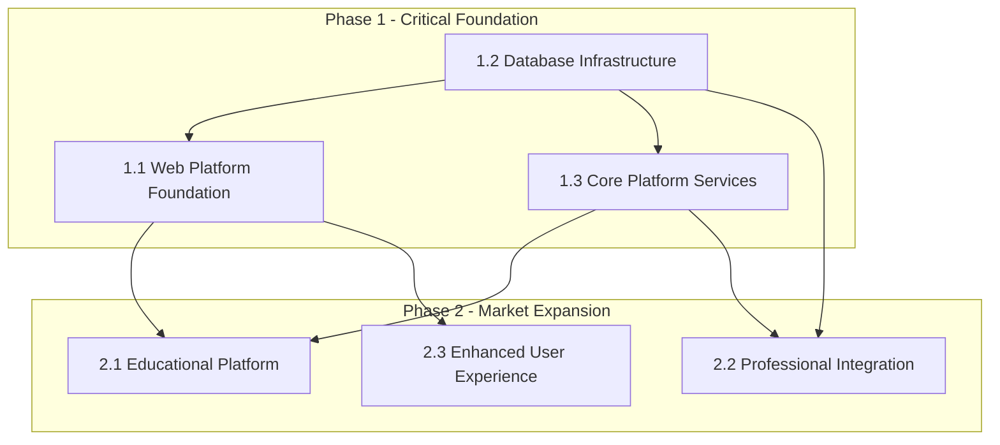

# ElectroSim Dependency Management Matrix

**Version:** 1.0  
**Date:** December 21, 2024  
**Work Breakdown Specialist Team**  
**Project:** ElectroSim Arduino Circuit Simulator  

---

## 🔗 Dependency Analysis Overview

This document provides comprehensive dependency mapping for ElectroSim's work breakdown structure, identifying critical paths, parallel work opportunities, and risk mitigation strategies for the 805 story point transformation.

---

## 📊 Critical Path Analysis

### Primary Critical Path (18 months)
The longest dependency chain through the project:

1. **Database Infrastructure** (Epic 1.2) - 3 months
   - PostgreSQL Cluster → Redis Caching → Data Schema → Migration Strategy
2. **Web Platform Foundation** (Epic 1.1) - 2 months  
   - GraphQL API → Authentication → Web Interface
3. **Educational Platform** (Epic 2.1) - 3 months
   - Tutorial System → LMS Integration → Analytics
4. **Advanced Analytics** (Epic 3.1) - 4 months
   - Learning Analytics → AI Assistance → Performance Analysis
5. **Enterprise Integration** (Epic 3.2) - 3 months
   - Multi-Cloud → SSO & Compliance → White-label
6. **Platform Ecosystem** (Epic 3.3) - 3 months
   - Plugin Architecture → Marketplace → API Partners

### Secondary Critical Paths
- **Professional Tools Path**: Core Platform → CI/CD Integration → Headless Testing → Virtual Serial (12 months)
- **Collaboration Path**: Database → Real-time Foundation → Collaborative Features → Community Features (14 months)
- **Mobile Path**: Web Platform → Responsive Interface → Mobile Optimization → Offline Capabilities (10 months)

---

## 🎯 Epic-Level Dependencies

### Phase 1: Platform Foundation Dependencies



#### Epic Dependency Details

**Epic 1.2 (Database Infrastructure) → All Phase 2 Work**
- **Dependency Type**: Hard dependency
- **Risk Level**: High
- **Mitigation**: Prioritize database work, implement dual-write early
- **Impact**: 6-week delay in database affects entire Phase 2 timeline

**Epic 1.1 (Web Platform) → All User-Facing Features**  
- **Dependency Type**: Hard dependency
- **Risk Level**: Medium-High
- **Mitigation**: Parallel frontend/backend development where possible
- **Impact**: Web platform delays affect user story delivery

**Epic 1.3 (Core Services) → Advanced Features**
- **Dependency Type**: Soft dependency for basic features, hard for advanced
- **Risk Level**: Medium
- **Mitigation**: Monolithic deployment initially, microservices evolution
- **Impact**: Service architecture affects scalability, not basic functionality

---

## 📋 Feature-Level Dependencies

### Phase 1 Feature Dependencies

#### Epic 1.1: Web Platform Foundation
```
1.1.1 GraphQL API Architecture
├── ENABLES → 1.1.2 Authentication & Authorization
├── ENABLES → 1.1.3 Web Interface Migration
└── ENABLES → All Phase 2 user-facing features

1.1.2 Authentication & Authorization  
├── REQUIRES ← 1.1.1 GraphQL API Architecture (schema)
├── ENABLES → 2.1.2 LMS Integration (SSO)
├── ENABLES → 2.3.2 Collaborative Features (user management)
└── ENABLES → 3.2.2 Enterprise SSO (extension)

1.1.3 Web Interface Migration
├── REQUIRES ← 1.1.1 GraphQL API Architecture  
├── REQUIRES ← 1.1.2 Authentication & Authorization
├── ENABLES → 2.1.1 Interactive Tutorial System
└── ENABLES → 2.3.3 Mobile-Responsive Interface
```

#### Epic 1.2: Database Infrastructure
```
1.2.1 Database Architecture Implementation
├── ENABLES → 1.2.2 Data Migration Strategy
├── ENABLES → 1.2.3 Real-time Collaboration Foundation
└── ENABLES → All data persistence features

1.2.2 Data Migration Strategy
├── REQUIRES ← 1.2.1 Database Architecture Implementation
├── ENABLES → 2.3.1 Advanced File Management (cloud sync)
└── RISK → Data integrity during migration

1.2.3 Real-time Collaboration Foundation  
├── REQUIRES ← 1.2.1 Database Architecture Implementation
├── REQUIRES ← 1.1.1 GraphQL API Architecture (subscriptions)
├── ENABLES → 2.3.2 Collaborative Features
└── ENABLES → 3.1.1 Learning Analytics (real-time data)
```

### Phase 2 Feature Dependencies

#### Epic 2.1: Educational Platform
```
2.1.1 Interactive Tutorial System
├── REQUIRES ← 1.1.3 Web Interface Migration
├── REQUIRES ← 1.2.1 Database Architecture (content storage)
├── ENABLES → 2.1.2 LMS Integration Framework
└── ENABLES → 2.1.3 Student Progress Analytics

2.1.2 LMS Integration Framework
├── REQUIRES ← 2.1.1 Interactive Tutorial System
├── REQUIRES ← 1.1.2 Authentication & Authorization (SSO)
├── ENABLES → 2.1.3 Student Progress Analytics (gradebook)
└── ENABLES → 3.2.2 Enterprise SSO & Compliance

2.1.3 Student Progress Analytics
├── REQUIRES ← 2.1.1 Interactive Tutorial System (data)
├── REQUIRES ← 2.1.2 LMS Integration Framework (context)
├── ENABLES → 3.1.1 Learning Analytics Dashboard
└── ENABLES → 3.1.2 AI-Powered Code Assistance (learning data)
```

#### Epic 2.2: Professional Integration  
```
2.2.1 CI/CD Pipeline Integration
├── REQUIRES ← 1.3.1 Microservices Architecture (service boundaries)
├── ENABLES → 2.2.2 Headless Testing Framework
└── ENABLES → 3.2.1 Multi-Cloud Deployment (CI/CD patterns)

2.2.2 Headless Testing Framework  
├── REQUIRES ← 2.2.1 CI/CD Pipeline Integration
├── ENABLES → 2.2.3 Virtual Serial Port System
└── ENABLES → 3.1.3 Predictive Performance Analysis

2.2.3 Virtual Serial Port System
├── REQUIRES ← 2.2.2 Headless Testing Framework
├── SOFT DEPENDENCY ← 1.3.2 Event-Driven Communication
└── ENABLES → Advanced hardware-in-loop testing
```

---

## 🚥 Story-Level Dependencies

### High-Impact Story Dependencies

#### US-1.2.1.1 → US-1.1.1.1 (Database → GraphQL Schema)
- **Dependency Type**: Data model dependency
- **Timeline Impact**: 2-3 day delay propagation
- **Mitigation**: Parallel design with frequent sync meetings
- **Risk**: Schema changes require GraphQL updates

#### US-1.1.2.1 → US-2.1.2.1 (Authentication → LTI Integration)
- **Dependency Type**: Authentication mechanism dependency  
- **Timeline Impact**: 1-2 sprint delay if auth changes
- **Mitigation**: Early authentication pattern establishment
- **Risk**: LTI compliance requires specific auth flows

#### US-1.2.3.1 → US-2.3.2.1 (Event Sourcing → Real-time Collaboration)
- **Dependency Type**: Technical architecture dependency
- **Timeline Impact**: 3-4 week delay propagation
- **Mitigation**: Event sourcing proof-of-concept early
- **Risk**: Operational transform complexity

### Parallel Work Opportunities

#### Independent Work Streams
```
Stream A: Content Development (No dependencies)
├── Tutorial content creation
├── Component library documentation  
├── Educational curriculum design
└── Marketing material development

Stream B: Frontend Design (Minimal dependencies)
├── UI/UX design and prototyping
├── Component library creation
├── Responsive design patterns
└── Accessibility testing

Stream C: Infrastructure Setup (Parallel to development)
├── Cloud environment provisioning
├── CI/CD pipeline configuration
├── Monitoring and alerting setup
└── Security scanning integration
```

#### Parallelization Strategies
1. **Database Schema + GraphQL Design**: Parallel with frequent sync
2. **Frontend + Backend API**: Contract-first development
3. **Content Creation + Platform Development**: Independent streams
4. **Testing Framework + Feature Development**: TDD approach
5. **Documentation + Implementation**: Continuous documentation

---

## ⚠️ Risk Analysis and Mitigation

### High-Risk Dependencies

#### Database Migration (Epic 1.2)
**Risk**: Data corruption during migration affects all subsequent features
- **Probability**: Medium (30%)
- **Impact**: High (6-week delay)
- **Mitigation Strategies**:
  - Comprehensive backup and rollback procedures
  - Dual-write architecture with validation
  - Staged migration with rollback points
  - Extensive testing with production data copies

#### Real-time Collaboration (Epic 1.2.3)
**Risk**: Operational transform complexity delays collaborative features
- **Probability**: High (60%)  
- **Impact**: Medium-High (4-week delay)
- **Mitigation Strategies**:
  - Early proof-of-concept with ShareJS/Y.js
  - Start with simple text collaboration
  - Progressive enhancement to circuit collaboration
  - Alternative: lock-based collaboration initially

#### Authentication Integration (Epic 1.1.2)
**Risk**: Educational SSO requirements complicate authentication
- **Probability**: Medium (40%)
- **Impact**: Medium (3-week delay)
- **Mitigation Strategies**:
  - Research LTI and SAML requirements early
  - Use proven authentication libraries
  - Build extensible authentication architecture
  - Plan for multiple authentication methods

### Medium-Risk Dependencies

#### GraphQL Performance (Epic 1.1.1)
**Risk**: Query optimization challenges under load
- **Probability**: Medium (35%)
- **Impact**: Medium (2-3 week delay)
- **Mitigation**: Early performance testing, DataLoader implementation

#### Mobile Responsiveness (Epic 2.3.3)
**Risk**: Touch interface complexity for circuit editing
- **Probability**: Medium (45%)
- **Impact**: Low-Medium (2-week delay)  
- **Mitigation**: Progressive enhancement, touch-first design

#### AI Integration (Epic 3.1)
**Risk**: Machine learning model complexity
- **Probability**: High (70%)
- **Impact**: Low (can be phased delivery)
- **Mitigation**: Start with rule-based systems, ML enhancement later

---

## 📅 Dependency-Based Scheduling

### Phase 1 Optimal Schedule (6 months)
```
Month 1-2: Foundation Setup
├── Database Infrastructure (Epic 1.2) - CRITICAL PATH
├── GraphQL API Architecture (Epic 1.1.1) - Parallel start
└── Core Platform Services (Epic 1.3) - Basic setup

Month 3-4: Platform Integration  
├── Authentication & Authorization (Epic 1.1.2)
├── Web Interface Migration (Epic 1.1.3) 
└── Data Migration Strategy (Epic 1.2.2)

Month 5-6: Real-time and Performance
├── Real-time Collaboration Foundation (Epic 1.2.3)
├── Performance Optimization (Epic 1.3.3)
└── Platform testing and hardening
```

### Phase 2 Dependency-Optimized Schedule (6 months)
```
Month 7-8: Educational Foundation
├── Interactive Tutorial System (Epic 2.1.1) - PRIORITY PATH
├── CI/CD Pipeline Integration (Epic 2.2.1) - Parallel
└── Advanced File Management (Epic 2.3.1) - After migration

Month 9-10: Integration and Collaboration
├── LMS Integration Framework (Epic 2.1.2)
├── Headless Testing Framework (Epic 2.2.2)  
└── Collaborative Features (Epic 2.3.2)

Month 11-12: Analytics and Mobile
├── Student Progress Analytics (Epic 2.1.3)
├── Virtual Serial Port System (Epic 2.2.3)
└── Mobile-Responsive Interface (Epic 2.3.3)
```

### Phase 3 Advanced Features (12 months)
Flexible scheduling based on Phase 1-2 learnings and market feedback.

---

## 🔄 Dependency Change Management

### Change Impact Assessment
When dependencies change:
1. **Immediate Impact Analysis**: Identify affected stories and epics
2. **Timeline Recalculation**: Update critical path and milestone dates
3. **Resource Reallocation**: Adjust team assignments and parallel work
4. **Stakeholder Communication**: Notify affected parties with revised timeline
5. **Risk Reassessment**: Update risk mitigation strategies

### Dependency Tracking Tools
- **JIRA/Linear**: Story-level dependency tracking
- **Microsoft Project**: Critical path analysis and Gantt charts
- **Miro/Mural**: Visual dependency mapping
- **Custom Dashboard**: Real-time dependency health monitoring

### Weekly Dependency Review
- Review changed dependencies and impact
- Update critical path analysis
- Identify new parallel work opportunities  
- Assess risk mitigation effectiveness
- Plan dependency resolution strategies

---

This Dependency Management Matrix provides the framework for navigating ElectroSim's complex transformation while maximizing parallel work and minimizing timeline risk through proactive dependency management.